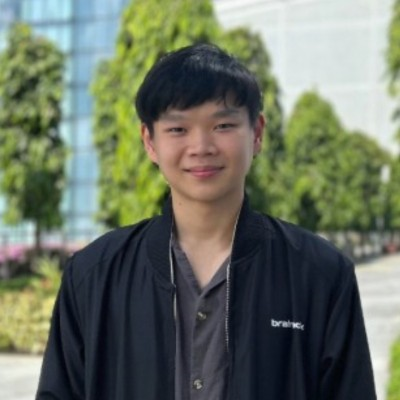
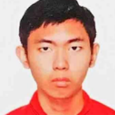
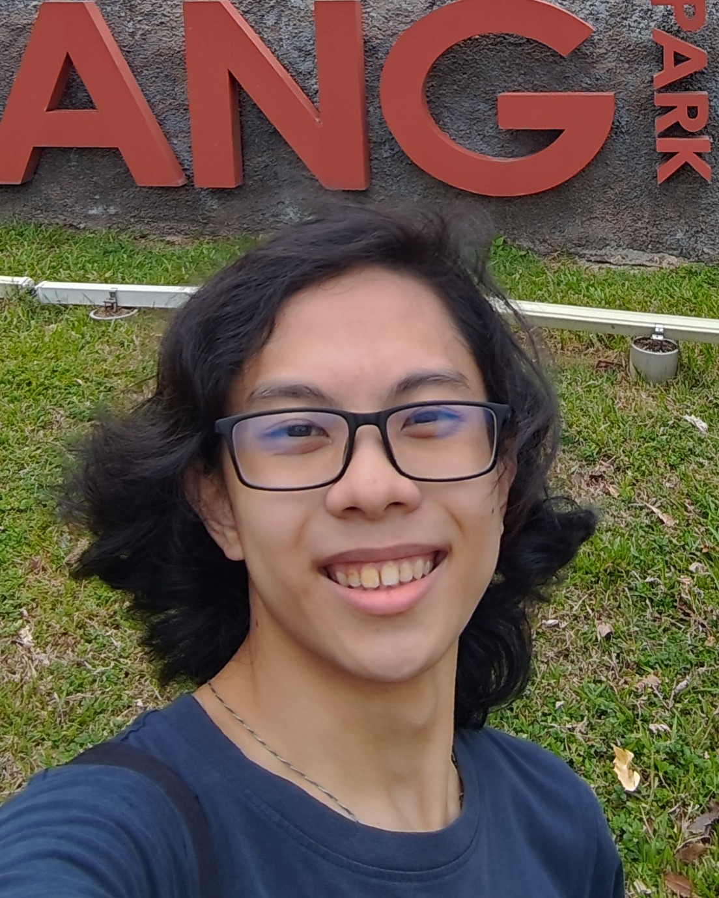

We are a team based in the [School of Computing, National University of Singapore](https://www.comp.nus.edu.sg).

You can reach us at the email `seer[at]comp.nus.edu.sg`

## Project team

### Javier Lim

[[github](https://github.com/JavierLimZH)]

* Role: Developer
* Responsibilities: Testing and code quality

### John Doe

[[homepage](http://www.comp.nus.edu.sg/~damithch)]
[[github](https://github.com/johndoe)]
[[portfolio](team/johndoe.md)]

- Role: Project Advisor

### Jane Doe

[[github](http://github.com/johndoe)]
[[portfolio](team/johndoe.md)]

- Role: Team Lead
- Responsibilities: UI

### BirdsArentReal

[[github](http://github.com/BirdsArentReal)] [[portfolio](team/johndoe.md)]

* Role: Developer
* Responsibilities: Logic, Code Quality

### Lin Zewei

[[github](http://github.com/cewau)]

* Role: Developer
* Responsibilities: A bit of everything

### Joon Zen

[[github](http://github.com/meowymacmeowza)]
[[portfolio](team/johndoe.md)]

* Role: Developer
* Responsibilities: Coding

### HUANG JUNCHENG

[[github](http://github.com/hytradebridge)]

- Role: Developer
- Responsibilities: UI
