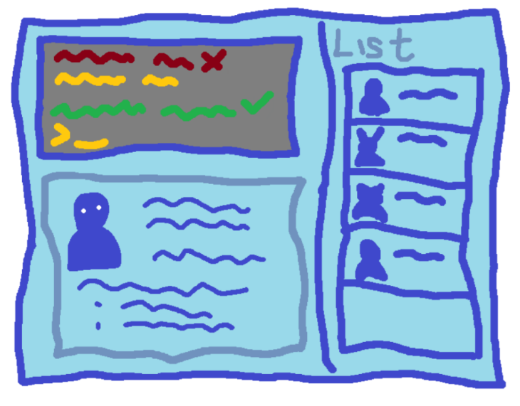

**Keep track of the people behind every application.**

LinkedOut is a desktop application in development for recruiters and HR administrators handling student applications across multiple job openings. Its recruitment workflow will bring together applicant contacts, hiring decisions, and the department contacts responsible for each role.

Text commands keep routine tasks quick, while a graphical interface provides an overview of your records. LinkedOut is designed as a personal workspace for one recruiter and stores data locally in editable JSON files.

*The current build supports contact management. Applicant registration, application status tracking, and recruitment details are under development. The guides currently describe the AddressBook foundation.*

* To run the current application, start with the [_Quick Start_ section of the **User Guide**](UserGuide.html#quick-start).
* To contribute, read the [**Developer Guide**](DeveloperGuide.html) and [**setup instructions**](SettingUp.html).
* Meet the team on the [**About Us**](AboutUs.html) page.

**Acknowledgements**

LinkedOut builds on [AddressBook-Level3](https://github.com/se-edu/addressbook-level3), created by the [SE-EDU initiative](https://se-education.org).

* Libraries used: [JavaFX](https://openjfx.io/), [Jackson](https://github.com/FasterXML/jackson), [JUnit 5](https://github.com/junit-team/junit5)
